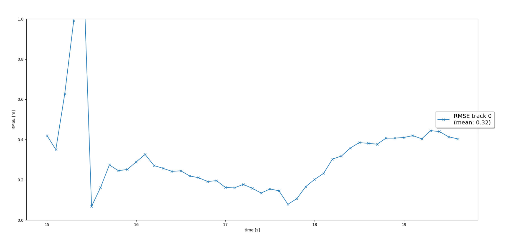
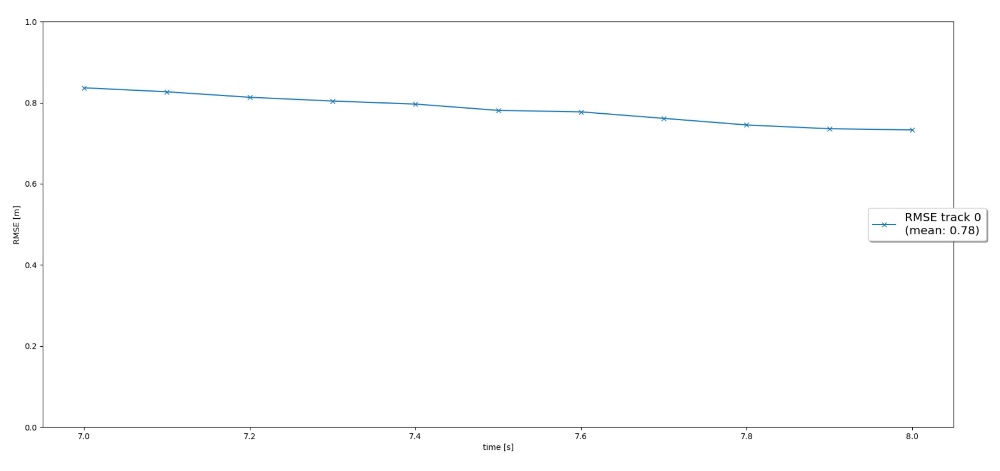
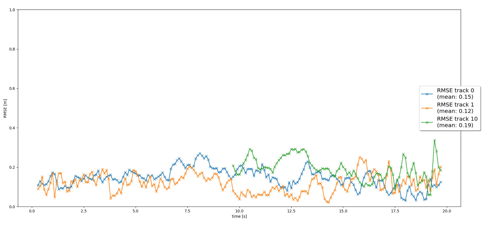

# Writeup: Track 3D-Objects Over Time

Please use this starter template to answer the following questions:

### 1. Write a short recap of the four tracking steps and what you implemented there (filter, track management, association, camera fusion). Which results did you achieve? Which part of the project was most difficult for you to complete, and why?

#### Step 1: EKF
In the first step I implemented an Extendend Kalman Filter (EKF) to track a single vehicle with LiDAR measurements input over time.
For this I implemented different functions for exmaple for the prediction and to update the current state of the vehicle.   
The results of one track can be found in the following image. The total mean is 0.32.

#### Step 2: Track management
In step 2 I implemented a track management to initialize and delete tracks, set a track state and a track score.
First of all I had to transform sensor to vehicle coordinates with a transformation matrix to project the unassigned LiDAR measurements into vehicle coordinate space. 
With the track management it is now possible to delete tracks if the track score is too low or P is too big.
Depending on the track score the track state can be set to 'tentative' or 'confirmed'.   
The image shows one track without any track losses. The total mean is 0.78. 

#### Step 3: Data association
In this step I implemented a single nearest neighbor data association to associate measurements to tracks. This is needed to do multi target tracking.
With the Mahalanobis distance the distance between all tracks and measurements can be calculated. Therefore every measurement can be assigned to one single track.   
After the data assocation different vehicles can be tracked parallel. The image shows three tracks with only LiDAR measurements. 

#### Step 4: Camera-LiDAR sensor fusion
In the last step I implemented the nonlinear camera measurement mode, so that the information from the LiDAR and camera can be fused.
The tracking loop now updates all tracks with LiDAR measurements, then with camera measurements.    
With the LiDAR and camera sensor fusion ghost tracks can be avoided. The results of the last step is shown in the following image.

The results can be found in the Video_of_results.zip folder.

#### Which part of the project was most difficult?
The most difficult part for me was to implement the sensor fusion in step 4. Because I neglect the fact that the factor H in the EKF is only for linear models, I didn't receive the correct
results with the camera as expected. Since the camera model is a non linear model I had to change H to h_x to receive better results. Also few of the ghost tracks are not deleted.
In that case I added another condition to the track management, when to delete tracks. By deleting tracks if the track score is under 0.17/params.window all ghost tracks were deleted quickly.

### 2. Do you see any benefits in camera-lidar fusion compared to lidar-only tracking (in theory and in your concrete results)? 
The benefits in camera-lidar fusion are clearly visible when you want to track different objects. By using an algorithm, which detects vehicles only by a LiDAR, it might happen that
the algorithm detects false positives. For example a bush which has the same shape as a vehicle could be identified as a vehicle. In that case a ghost track occure in the track management. 
To avoid these kind of ghost tracks it is neccessary to use a different sensor like a camera which can differentiate for example a bush from a vehicle.
The ghost track will then delete by the track management. The same case can be seen in the results of the project. A ghost track was detected by the LiDAR. Only when the LiDAR was fused by
the camera, the ghost track could be deleleted.

### 3. Which challenges will a sensor fusion system face in real-life scenarios? Did you see any of these challenges in the project?
Both of the used sensors have their benefits and disadvantages. For example the camera is able to classify objects, but is barely able to compute an exact distance to those objects.
The LiDAR can compute an exact distance to several objects. Because it is independent from light conditions it is also able to detect them for example in dark light conditions.
Because of the missing cTo improve the tracking results it is possible to work further on the neural networks which detect vehicles by a camera and a LiDAR. 
Also changing the Nearest Neighbour Algorithm is an opportunity to get better results.olor information and the low dense of information compared to the camera, the sensor is doing a poor job by classify objects.
If you imagine a real-life scenario where it is really dark and there is also heavy rain, both sensors will reach there limits and a sensor fusion brings nothing.
In the sequence of the project there were perfect weather conditions, so that I couldn't see any kind of challenges here.

### 4. Can you think of ways to improve your tracking results in the future?
To improve the tracking results it is possible to work further on the neural networks which detect vehicles by a camera and a LiDAR. 
Also changing the Nearest Neighbour Algorithm is an opportunity to get better results.

